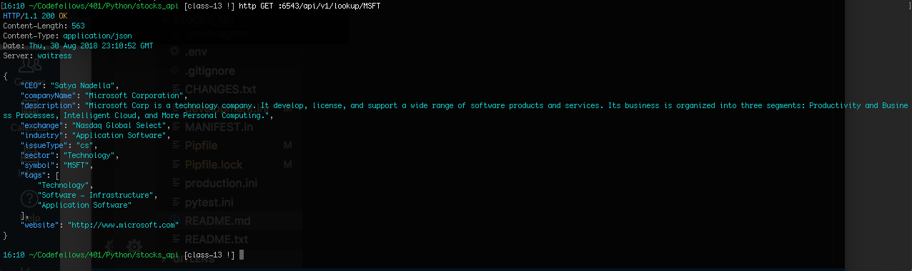

# Stocks API
Author: Stephen Harper

## Language, Frameworks and Tools: 
Python, VS Code, sqlalchemy, Pyramid framework, cryptacular and psycopg2-binary

## How to get started
1. Start a pipenv shell. 
2. Then download the relevant packages by typing in, 
"pipenv install -e ".[testing]"
3. Open your Terminal or Git Bash. Start your server by typing in, 
"pserve development.ini --reload" You should seet he localhost server, 6543 running. 
Example image below:

4. Once the server is running, open a separate terminal window. And follow the instructions below.

## API End points
1. Type in "https://api.iextrading.com/1.0/stock/(4 letter symbol for company)/company"
The four letter company can be whichever public company on the market. The example below is for Microsoft or MSFT.
2. If you type in a stocks 4 letter ticker symbol, you will get info about that company.
Example: MSFT

## License
This is under the MIT License
